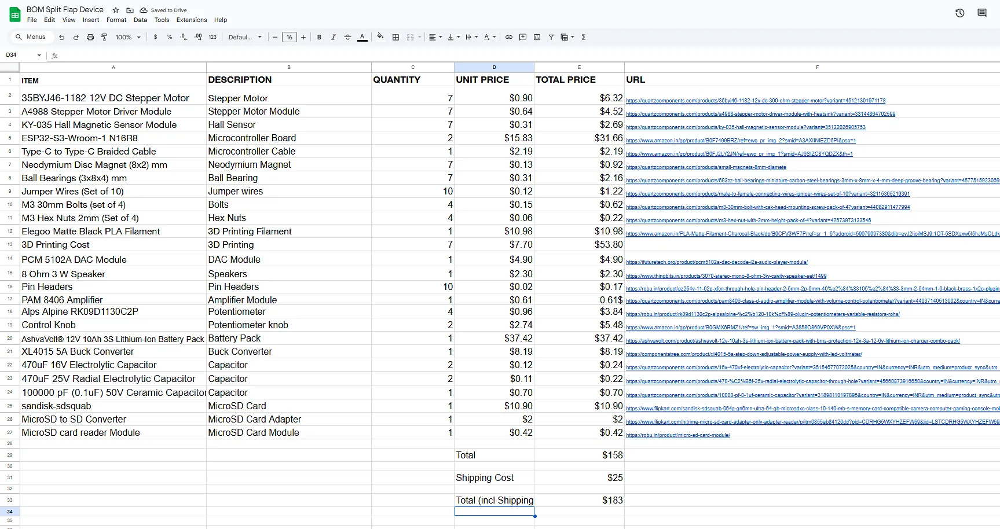

# Split-Flap-Machine

The Split Flap Machine is a 7 unit device which can display time, weather, weekday, date and even words! It can also play your favourite songs achieved by using an MicroSD Card!

The main attraction of this device is the flap system and its synchronous rotation of all flaps at a time. This device can be controlled through its local webserver.

#

A unit of Split Flap Device looks somewhat like this - 

A unit consists of a drum, 37 flaps, a stepper motor, a hall sensor and a ball bearing.

#

The total cost of the whole device is around $185

