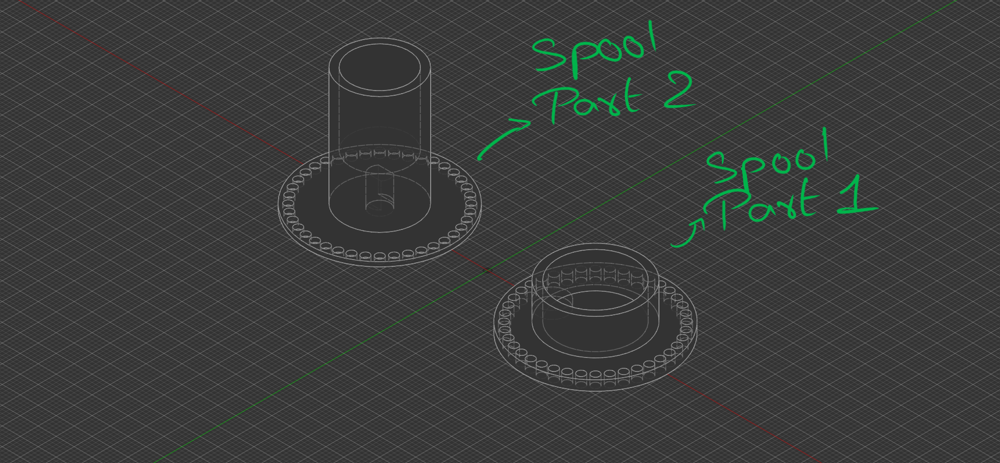
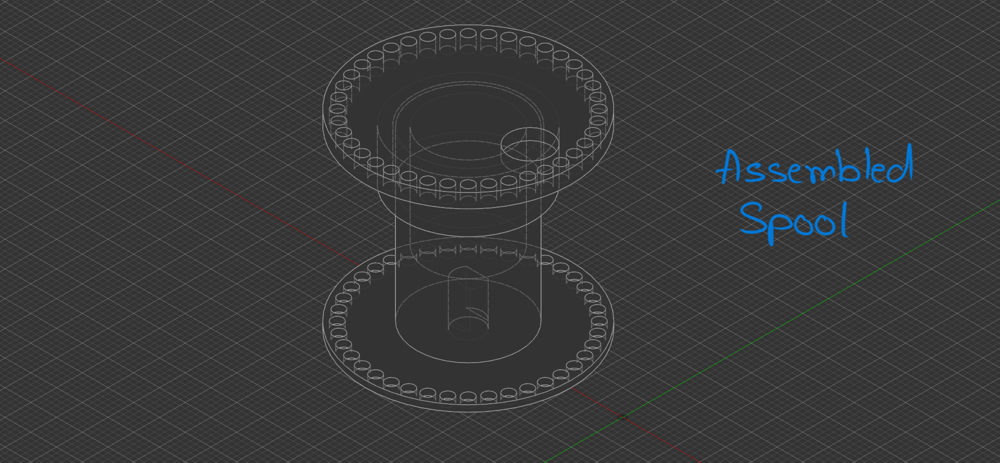
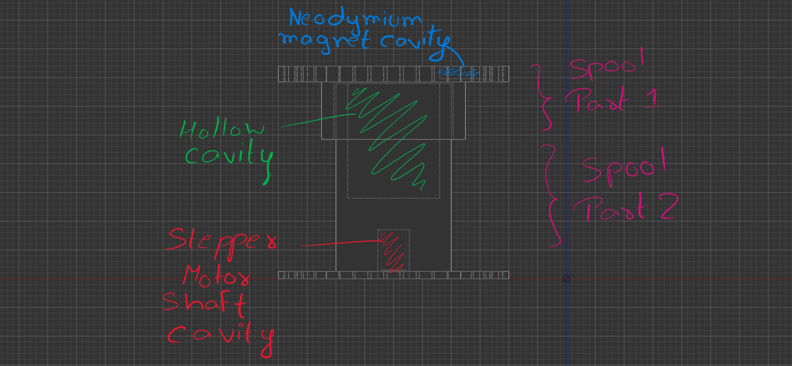
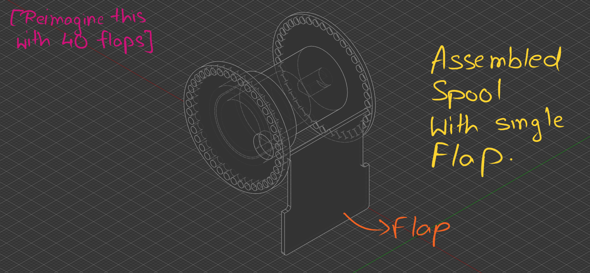
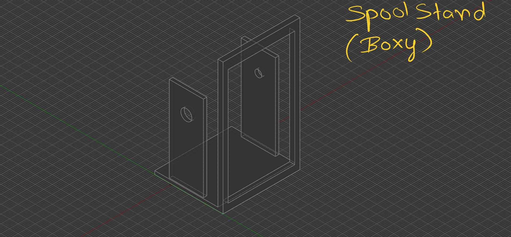
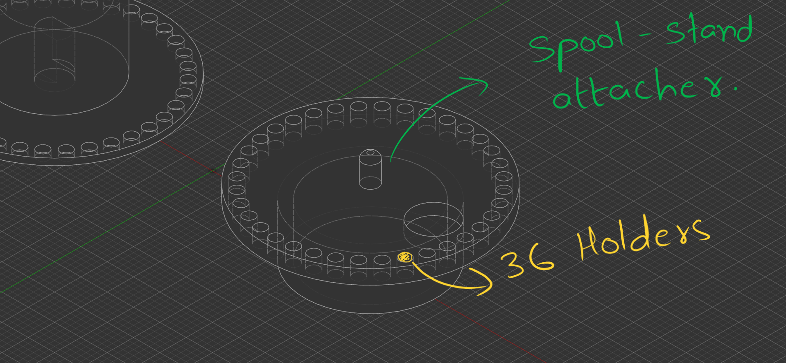
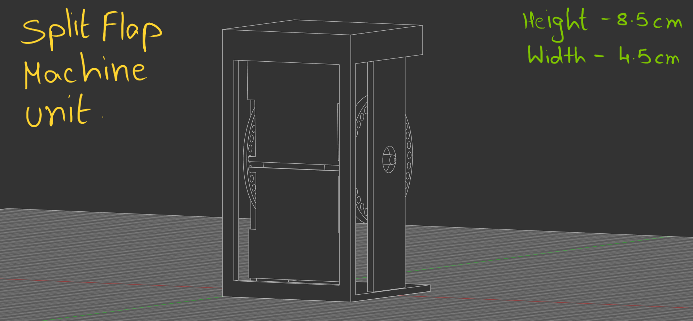
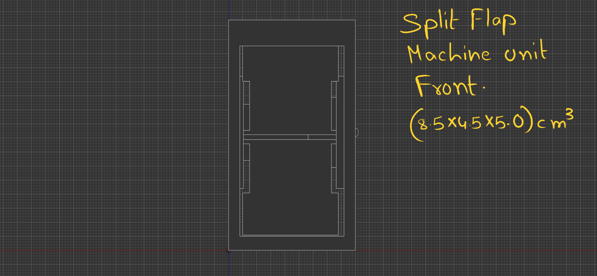
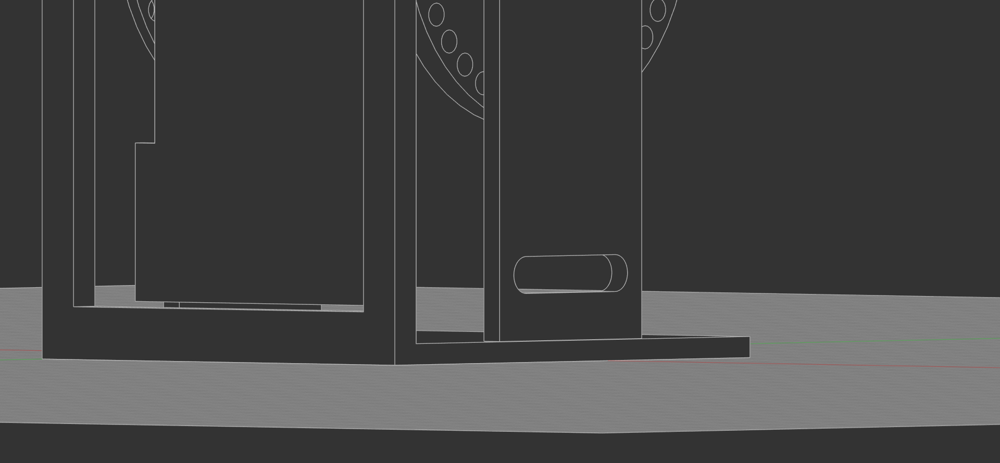
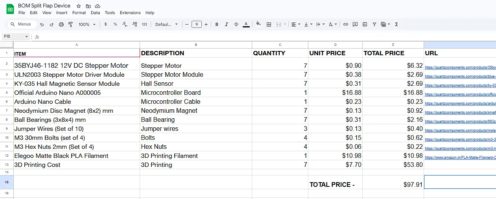

# Split-Flap-Machine
This file focuses on the process of creation of Split Flap Machine as created by Mag (The creator)

[Note - The measurements are not mentioned unless specified in the timeline text, It is expected that the reader will download the files to check the measurements]
#
Week 1

(D1)

Created the flaps (Self Explanatory)
Created the Spools (The drums where the flaps are placed for SFM to rotate)
 - The spool has been divided into 2 parts, The part 1 (The top part) and part 2 (The bottom part) [look at the image for better understanding]

Both the spools have 40 holes, having diameter greater than that of flap ends. The angle between the centres of two circles and the centre of the base of the spool is 9 degrees.

The spools are attached to eachother by inserting Spool 2 into Spool 1. For better understanding, please refer to the image below.

The spool 1 has a cavity for holding a Neodymium magnet for the working of Hall sensor which is specified later.
Simillarly spool 2 has a cavity for the Stepper motor's shaft to rotate the spool also specified later.

The semi constructed spool with flap is given below, for complexity and space constraints only one flap has been attached.

(D2)

Created a Spool stand. SPECIFICALLY designed for when the flaps of the spool hit the front part of the stand, it doesnt fall and stays there until there is a 10 degree rotation.

And we got some changes, Since The older spool design with 40 holder was TOO EXPENSIVE (The cost adds up for 7 of them, so its 280 if its 40 holders) so I reduced it to only 36. 26 for letters and 10 for numbers from 0-9.

Here you can see the spool stand attacher, ensuring that it can rotate freely without disorientating.

Welp, its 2am and I've made some changes. 
The spool stand attacher will work however for smooth rotation I have decided to use ball bearings of 3x8x4mm. I had to do multiple revisions and changes for the somewhat final SFM unit.
firstly I added a cavity for ball bearing as mentioned. Next I made the height of the SFM unit around 8.5cm and also had to add an offset slab which stops the top flap from falling down unless turned 10 degress. (See the image)
and next I updated the overall look of the Stand it looks more boxier and it was the design I was going for.

(D3)

As soon as I woke up I made a cavity in the Spool Holder for a screw so that when the flaps fall they make the sound which we want to hear and also makes the flaps not swing after falling down (This is the major cause).

Next Since the design was nearly final I made a BOM list although I Have not decided yet how to power this so I have not included any power supply or things which are used to power this (I have to Research). And the total cost of the machine comes to nearly 97$, A whole lot of expensive, Major cost includes 3d printing service, filament and Arduino Nano. Well 3d printing in my local is much cheaper than online service which is charging, 110$ JUST FOR THE FLAPS OF 7 UNITS! In the price of flaps I can print my whole machine locally, However I doubt blueprint will give me funds to convert credit into real money so I can pay the local service so I doubt it.

