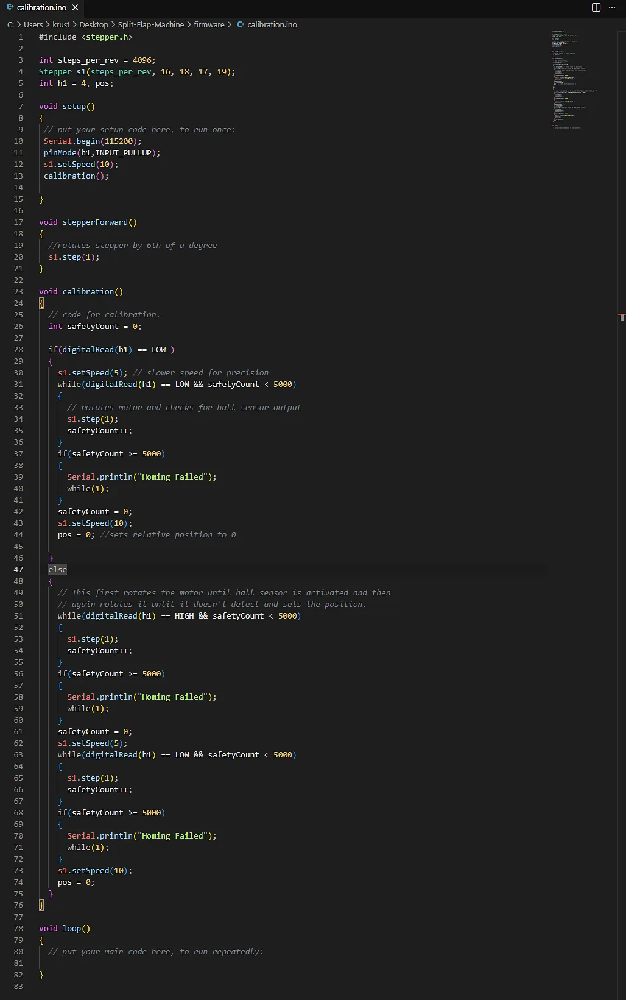

# Split-Flap-Machine
This file focuses on the process of creation of Split Flap Machine as created by Mag (The creator)

[Note - The measurements are not mentioned unless specified in the timeline text, It is expected that the reader will download the files to check the measurements]
#
Week 1

(D1)

Created the flaps (Self Explanatory)
Created the Spools (The drums where the flaps are placed for SFM to rotate)
 - The spool has been divided into 2 parts, The part 1 (The top part) and part 2 (The bottom part) [look at the image for better understanding]

Both the spools have 40 holes, having diameter greater than that of flap ends. The angle between the centres of two circles and the centre of the base of the spool is 9 degrees.

The spools are attached to eachother by inserting Spool 2 into Spool 1. For better understanding, please refer to the image below.

The spool 1 has a cavity for holding a Neodymium magnet for the working of Hall sensor which is specified later.
Simillarly spool 2 has a cavity for the Stepper motor's shaft to rotate the spool also specified later.

The semi constructed spool with flap is given below, for complexity and space constraints only one flap has been attached.

(D2)

Created a Spool stand. SPECIFICALLY designed for when the flaps of the spool hit the front part of the stand, it doesnt fall and stays there until there is a 10 degree rotation.

And we got some changes, Since The older spool design with 40 holder was TOO EXPENSIVE (The cost adds up for 7 of them, so its 280 if its 40 holders) so I reduced it to only 36. 26 for letters and 10 for numbers from 0-9.

Here you can see the spool stand attacher, ensuring that it can rotate freely without disorientating.

Welp, its 2am and I've made some changes. 
The spool stand attacher will work however for smooth rotation I have decided to use ball bearings of 3x8x4mm. I had to do multiple revisions and changes for the somewhat final SFM unit.
firstly I added a cavity for ball bearing as mentioned. Next I made the height of the SFM unit around 8.5cm and also had to add an offset slab which stops the top flap from falling down unless turned 10 degress. (See the image)
and next I updated the overall look of the Stand it looks more boxier and it was the design I was going for.

(D3)

As soon as I woke up I made a cavity in the Spool Holder for a screw so that when the flaps fall they make the sound which we want to hear and also makes the flaps not swing after falling down (This is the major cause).

Next Since the design was nearly final I made a BOM list although I Have not decided yet how to power this so I have not included any power supply or things which are used to power this (I have to Research). And the total cost of the machine comes to nearly 97$, A whole lot of expensive, Major cost includes 3d printing service, filament and Arduino Nano. Well 3d printing in my local is much cheaper than online service which is charging, 110$ JUST FOR THE FLAPS OF 7 UNITS! In the price of flaps I can print my whole machine locally, However I doubt blueprint will give me funds to convert credit into real money so I can pay the local service so I doubt it.

(D4)

This day was brainfoggy one, I had no idea how to code the script and I had to go through multiple videos of how arduino's control stepper motors, haul sensor and in basic the whole setup (the code is same for arduino and esp32). Even after all this, I was still not able to find what to do so I asked chatGPT and it asked me to follow a path. I had the map and was on my own, testing logics and all. I worked on calibration today, What it does is that everytime the SFM starts up, it doesnt know which letter it is displaying so in the calibration it slowly rotates the spool and uses the hall sensor to detect the magnet, when the magnet is in close contact to the hall sensor the hall sensor reads LOW and vice versa. So this calibration is only right when the hall sensor first reads HIGH then LOW then HIGH and the point where hall sensor transitions from LOW to HIGH is the point of 0 position and all characters are labelled relative to this position.

(D6)

Today I made a code to fetch time from the internet (watch this video for info : https://youtu.be/9OcewS8sa68?si=-juCJv46duffQA7_). And I also updated the BOM list because with only 1 esp 32, I would be falling short of gpio pins for the motors and other features, So I had two options either use a gpio extension board or buy another esp 32. After painfully reading the advantages and disadvantages of both, it was quite clear that another esp 32 is the best option so I did  so!

(D7)

In todays episode of Split Flap Device, I made a code for all the 7 units of the device to calibrate at once!

This is achieved by calling the setupCalibration() function from the main .ide file. This function then called the fullCalibration() function.

Here's a simple explanation of the full calibration function - First the hall sensors output is detected if it is on the magnet or near its magnetic field, it goes in the first if block, in it one motor is rotated by 1 step and then it is checked if the hall sensors output has changed, if not it goes to the setupCalibration() function and in the loop follows fullCalibration() function again for another stepper motor.

This process might seem lengthy but to the human eye it seems as if all the 7 units are being calibrated at once! The delay between 2 fullCalibration() functions is so small that it is not noticable!

Props to Chatgpt for letting me know this process, It was quite interesting and very understandable and I was able to code without any help of chatGPT using my own skills!

# 
Week 2

(D8)

This was one of the most productive days.

Today I made a program to display time, date, weather, weekday on my split flap device!

Inshort today was a day of arduino ide, It took a lot of time, approximately 6 hours for all these but it was worth it!

the displaying works on the following principle -
It first arranges the words to be displayed in a character array and compares it with ascii values, if it matches it goes on an gets a position which is calculated so that only that letters position is sent. Next the motors rotate one by one by 1 step until all of they reach their final position.

This is the basic program and is used in all 4 of my programs. The weather program however uses api to get its data from the internet through esp 32s wifi feature.

Thats it for today, tommorrows plan is to make a webserver for esp32 and make a program so that when a word is entered in the webserver it is displayed on the split flap machine.

